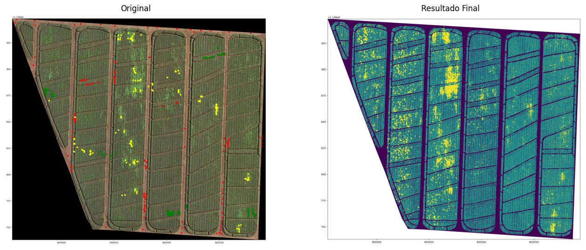
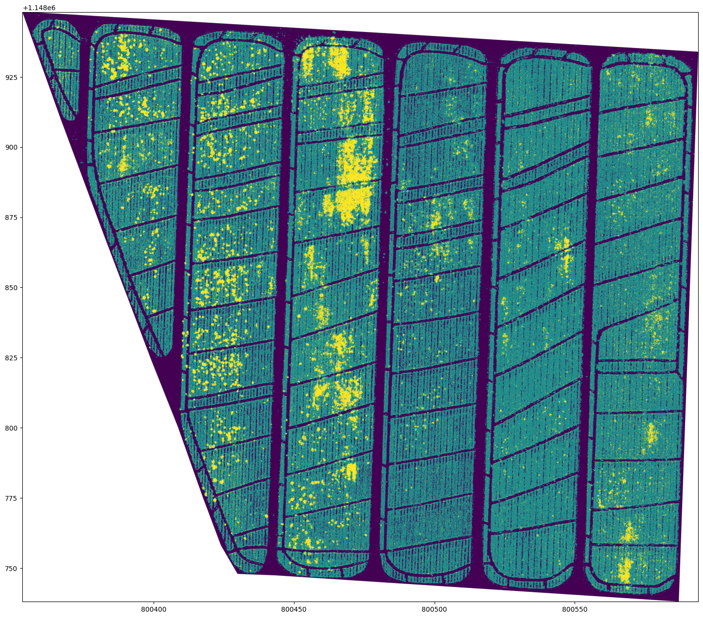

# 🌱 Mapeamento de Vegetação, Ervas Invasoras e Solo

## Utilizando OpenCV e Redes Neurais

Este projeto foi desenvolvido no Google Colab e utiliza processamento de imagens e redes neurais para identificar regiões de vegetação saudável, ervas daninhas invasoras e solo exposto a partir de imagens espectrais.

Link para o Colab: https://colab.research.google.com/drive/1MehLj8HyTOiAAFow_jPEKq0jJJt6_gMy#scrollTo=V9d6Hv1GvT-E

Desenvolvido no Google Colab com bibliotecas como:
* cv2
* numpy
* rasterio
* pandas
* geopandas
* matplotlib
* sklearn
* tensorflow
---

📌 Comparação:

🖼️ Foto Inicial:

🖼️ Resultado Final:

